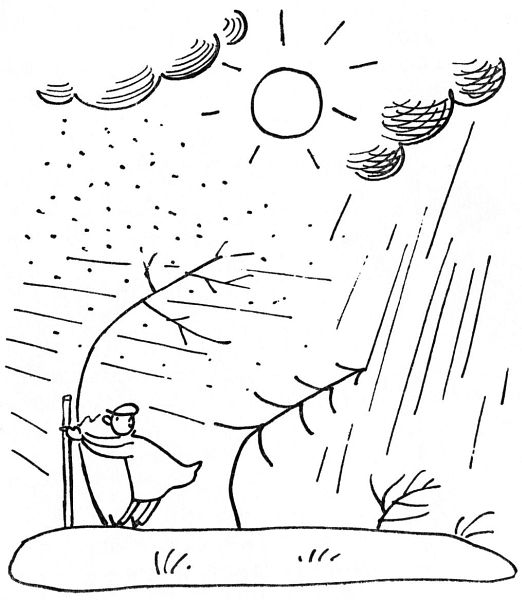
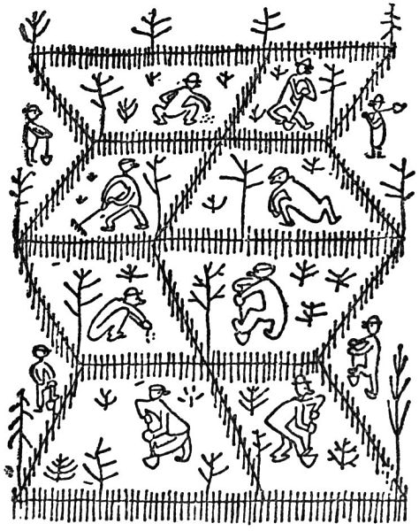
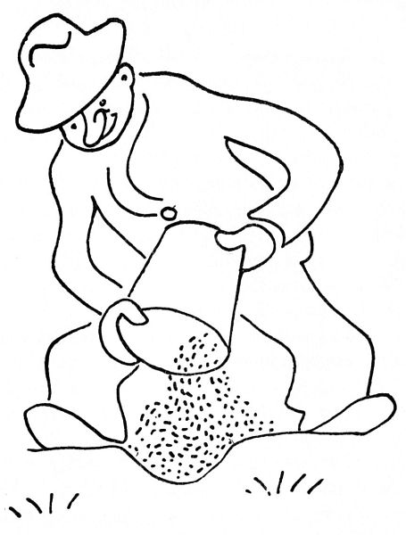
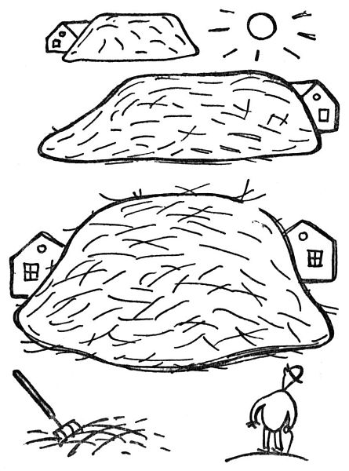

Zahradník v únoru pokračuje v lednových pracích, zejména potud, že pěstuje hlavně počasí. Neboť vězte, že únor je doba nebezpečná, která zahradníka ohrožuje holomrazy, sluncem, vlhkem, suchem a větry; tento nejkratší měsíc, tento záprtek mezi měsíci, tento měsíc nedonošený, přestupný a vůbec nesolidní, vyniká nad všechny ostatní svými potměšilými záludy; mějte se před ním na pozoru. Ve dne loudí na keřích pupence a v noci je spálí; jednou rukou nám lahodí a druhou nám luská pod nosem. Čertví proč se o přestupných letech přidává jeden den zrovna tomuto vrtkavému, katarálnímu, poťouchlému měsíčnímu skrčkovi; o přestupný rok by se měl přidat jeden den krásnému měsíci máji, aby jich bylo dvaatřicet, a bylo by to. Jakpak k tomu my zahradníci přijdem?

  

Další sezónní práce v únoru je _honění prvních známek jara_. Zahradník nedá na prvního chrousta nebo motýla, který obyčejně v novinách zahajuje jaro; předně o žádné chrousty vůbec nestojí, a za druhé takový první motýl je obyčejně poslední od loňska, který zapomněl umřít. První známky jara, po kterých se zahradník pídí, jsou neklamnější. Jsou to:

_1._ _krokusy_, které mu vyrážejí v trávě jako takové nalité, zavalité hrotky; jednoho dne ten hrotek praskne (při tom ještě nikdo nikdy nebyl) a udělá takovou štětku krásně zelených listů; a to je první známka jara; dále:

_2._ _zahradnické ceníky_, které mu nosí listonoš. Ačkoliv je zahradník zná zpaměti (tak jako Iliada začíná slovy Ménin aeide, thea[****\[4\]****](./resources/undefined), začínají tyto katalogy slovy: Acaena, Acantholimon, Acanthus, Achillea, Aconitum, Adenophora, Adonis a tak dále, což každý zahradník dovede odříkávat, jako když bičem mrská), přece je pečlivě pročte od Acaeny až po Wahlenbergii nebo Yuccu, prodělávaje těžký boj, co by si měl ještě přiobjednat.

  

_3\. Sněženky_ jsou další posel jara; nejdřív to jsou takové bledě zelené špičky vykukující z půdy; ty se pak rozštípnou ve dva tlusté děložní lupeny, a je to. Potom to vykvete někdy už počátkem února, a pravím vám, že žádná vítězná palma, ani strom poznání, ani vavřín slávy není krásnější než ten bílý a křehký kalíšek na bledém stonku, kývající se v sychravém větru.

_4\. Sousedé_ jsou rovněž neklamnou známkou jara. Jakmile se vyhrnou na své zahrádky s rýči a motykami, nůžkami a lýkem, nátěry na stromy a všelijakými prášky do půdy, poznává zkušený zahradník, že se blíží jaro; i oblékne si staré kalhoty a vyhrne se na zahrádku s rýčem a motykou, aby i jeho sousedé poznali, že se blíží jaro, a sdělovali se přes plot o tuto radostnou novinku.

  

Půda se otevírá, ale ještě nevydává zelený list; ještě je možno brát ji jako takovou, jako holou a čekající půdu. Teď ještě je doba všeho mrvení a rytí, rigolování čili regalování, kypření a mísení. Tu tedy zahradník shledává, že jeho půda je příliš těžká, příliš vazká nebo příliš písčitá, příliš kyselá nebo příliš suchá; zkrátka propuká v něm náruživost ji nějak zlepšovat. Vězte, že půdu lze zlepšovat tisícerými prostředky; naneštěstí je zahradník obyčejně nemá po ruce. Ve městě je poněkud nesnadno mít doma zrovna holubí trus, bukové listí, zetlelý kravský hnůj, starou omítku, starou rašelinu, uleželou drnovku, zvětralé krtiny, lesní humus, říční písek, mórovku[\[5\]](./resources/undefined), bahno z rybníka, půdu z vřesovišť, dřevěné uhlí, dřevěný popel, rozemleté kosti, rohové piliny, starou močůvku, koňskou mrvu, vápno, sfagnum[\[6\]](./resources/undefined), trouchnivinu z pařezů a ostatní živné, kypřící a blahodárné látky, nepočítáme-li dobrý tucet dusíkatých, hořečnatých, fosfátových a všelikých jiných hnojiv.

Jsou sice chvíle, kdy by si zahradník přál pěstovat, přehazovat a kompostovat všechny ty ušlechtilé půdičky, přísady a hnojíky; bohužel by mu pak na zahrádce nezbylo místa na kytky. Tu tedy aspoň zlepšuje půdu, jak může; shání doma vaječné skořápky, spaluje kosti od oběda, schovává své ostříhané nehty, vymetá z komína saze, vybírá z dřezu písek, nabodne na ulici na hůl krásný koňský celák, a to vše pečlivě zarývá do své půdy; neboť jsou to kypřivé, teplé a hnojivé substance. Vše, co je, se buď hodí do půdy, nebo ne. Jen zbabělý stud brání zahradníkovi, aby nešel sbírat na ulici, co utrousili koně; ale kdykoliv uvidí na dlažbě pěknou hromádku mrvy, vzdychne si aspoň, jaké je to mrhání božím darem.

Když si tak člověk představí takovou horu hnoje na selském dvoře – – Já vím, jsou všelijaké prášky v plechových pikslách; můžeš si koupit, nač si vzpomeneš, všeho druhu sole, výtažky, strusky a moučky; můžeš očkovat půdu bakteriemi; můžeš ji obdělávat v bílém plášti jako pan asistent na univerzitě nebo v apatyce. To všecko můžeš učinit, zahradníku městský; ale když si tak představíš takovou hnědou a tučnou horu hnoje na selském dvoře –

Ale, abyste věděli, sněženky už kvetou; kvete i hamamelis žlutými hvězdičkami a čemeřice nese tlustá poupata; a když se pořádně podíváte (musíte přitom zatajit dech), naleznete pupence a klíčky skoro na všem; tisícerým tenounkým pulzem stoupá život z půdy. My, zahradníci, se už nedáme; už ženeme do nové mízy.

