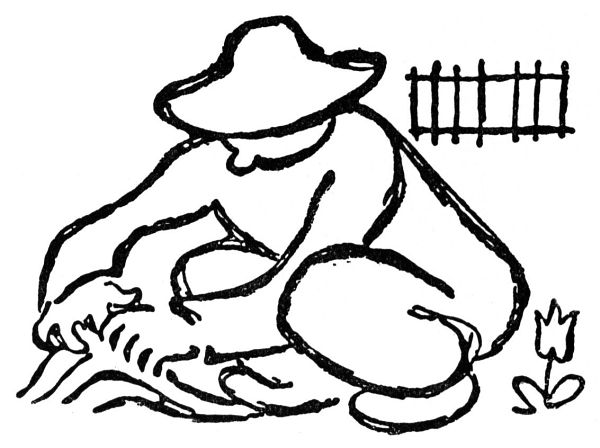
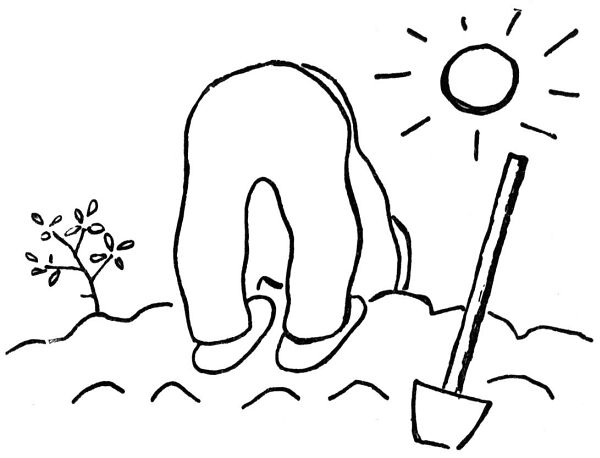
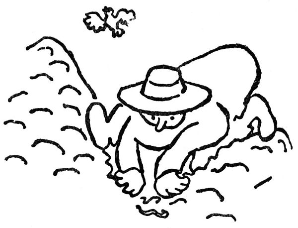
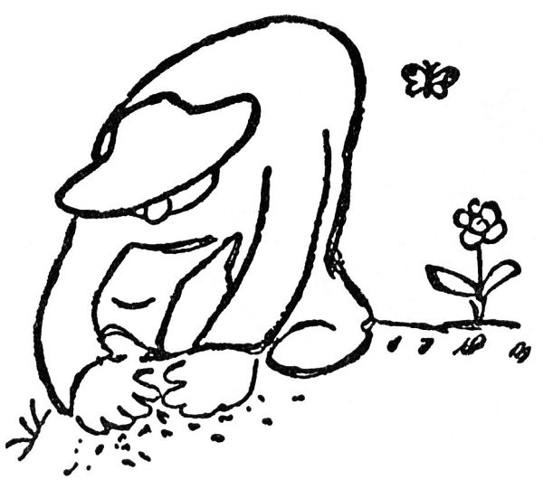

Pokud jsem byl jenom vzdáleným a roztržitým divákem na hotové dílo zahrádek, považoval jsem zahradníky za osoby ducha zvláště poetického a jemného, které pěstují vůni květin, naslouchajíce zpěvu ptačímu. Nyní, když se dívám na věc z větší blízkosti, shledávám, že pravý zahrádkář není člověk, který pěstuje květiny; je to muž, který pěstuje hlínu. Je to tvor, který se zarývá do země a nechává podívanou na to, co je nad ní, nám, lelkujícím budižkničemům. Žije ponořen v zemi. Staví svůj pomník v hromadě kompostu. Kdyby přišel do zahrady ráje, začichal by opojen a řekl by: „Tady je, panečku, humus!“ Myslím, že by zapomněl pojíst ovoce stromu poznání dobrého a zlého; spíše by koukal, jak by mohl Hospodinu odvézt nějaké to kolečko rajské prsti. Nebo by shledal, že strom poznání dobrého a zlého nemá kolem sebe uděláno pěkné mísovité rabátko, i začal by se tam mrvit v hlíně, nevěda ani, co mu visi nad hlavou. „Adame, kde jsi?“ zavolal by Hospodin. „Hned,“ odpověděl by zahradník přes rameno, „teď nemám kdy.“ A dělal by dál své rabátko.

  

Kdyby byl člověk zahradník vznikal od počátku světa přírodním výběrem, byl by se patrně vyvinul v nějakého bezobratlovce. K čemu vůbec má zahradník záda? Jak se zdá, jen k tomu, aby si je chvílemi narovnával, pravě: „To mě bolí záda!“ Co se nohou týče, dají se všelijak skládat; lze sedět na bobku, klečet na kolenou, vpravit nějak nohy pod sebe, nebo konečně si je dát za krk; prsty jsou dobré kolíky k dělání důlků, dlaně drtí hrudky nebo rozhrnují prsť, kdežto hlava slouží k zavěšení fajfky; jenom hřbet zůstává nepoddajnou věcí, kterou se zahradník marně pokouší náležitě ohnout. Zahradní žížala také nemá zad. Zahrádkář je obyčejně nahoře zakončen zadkem; nohy a ruce má rozkročené, hlavu někde mezi koleny, podoben pasoucí se klisně. Není to muž, který by chtěl „i jen píď jedinou přidati k své postavě“; naopak skládá svou postavu vejpůl, usedá na bobeček a zkracuje se všemožným způsobem; jak ho vidíte, zřídka měří přes metr výšky.

  

  

Pěstování hlíny záleží jednak v různém rytí, okopávání, obracení, zahrabávání, kypření, rovnání, hlazení a kadeření, jednak v přísadách. Žádný pudink nemůže být složitější než příprava zahradnické půdy; pokud jsem mohl sledovat, dává se do ní hnůj, mrva, guáno, listovka, drnovka, ornice, písek, sláma, vápno, kainit, Thomasova moučka, dětská moučka, ledek, rohovina, fosfáty, trus, krondaro[\[7\]](./resources/undefined), popel, rašelina, kompost, voda, pivo, vyklepané fajfky, ohořelé sirky, mrtvé kočky a mnohé jiné substance. To vše se ustavičně míchá, zarývá a přisoluje; jak řečeno, zahradník není člověk, který voní k růži, nýbrž který je stíhán představou, že by „ta půda chtěla ještě trochu vápna“ nebo že je těžká (jako cejn, říká zahradník) a „chtěla by víc písku“. Zahradnictví se stává věcí jaksi vědeckou. Dnes už by dívka nesměla jen tak zpívat: „Pod našema okny roste růže květ.“ Spíše by měla zpívat, že pod našema okny by se mělo nasypat ledku a bukového popele, pečlivě promíchaného s drobnou řezankou. Růže květ je tak říkajíc jenom pro diletanty; zahradníkova radost je zakořeněna hlouběji, až v lůně prsti. Po smrti se zahrádkář nestává motýlem opilým vůní květin, nýbrž žížalou okoušející všech temných, dusíkatých a kořenitých rozkoší hlíny.

  

Teď zjara jsou zahrádkáři neodolatelně, jak se říká, vábeni do svých zahrádek; sotva položí lžíci, už jsou na svých záhoncích, zvedajíce zadky k báječnému blankytu; tady rozemelou v prstech teplou hrudku, tady strčí blíž ke kořínkům zvětralý a drahocenný kousek loňského hnoje, tam vyrvou plevel a tuhle seberou kamínek; teď čechrají půdu kolem jahod a za chvíli se uklánějí několika sazeničkám salátu, nos u země, zamilovaně lechtajíce křehký chundel kořínků. V této poloze užívají jara, zatímco nad jejich bedry opisuje slunce svůj slavný koloběh, plují oblaka a páří se nebeské ptactvo. Už se otvírají poupata třešňová, mladé lupení se rozvíjí s líbeznou útlostí, kosi křičí jako blázni; tu se narovná pravý zahrádkář, protáhne se v kříži a praví zádumčivě: „Na podzim to hodně pohnojím a přidám drobet písku.“

Ale je jedna chvíle, kdy se zahrádkář vztyčí a rozvine ve své plné výši; je to odpolední hodinka, kdy své zahrádce udílí svátost kropení. Tehdy stojí, přímý a téměř vznešený, řídě trysk vody z hubičky hydrantu; voda šumí stříbrnou a zvučnou prškou; z kypré země zavane vonný dech vlhkosti, každý lístek je zrovna divoce zelený a jiskří chutnou radostí, že by jej člověk snědl. „Tak, teď má dost,“ šeptá zahradník blaženě; tím nemyslí třešničku zpěněnou poupaty ani nachovou meruzalku; míní hnědou prsť země.

A když zapadne slunce, praví s vrcholnou spokojeností: „To jsem se dnes nadřel!“

