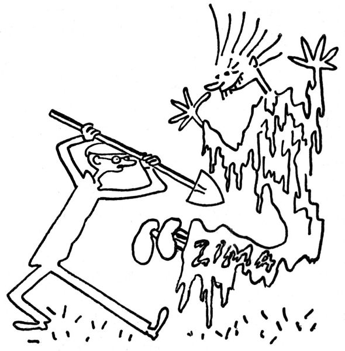
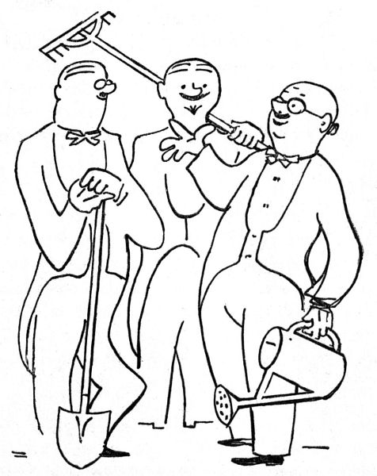

Máme-li podle pravdy a prastarých zkušeností vylíčit zahradníkův březen, musíme především pečlivě rozlišit dvě věci: A) co zahradník činiti má a chce, a B) co skutečně činí, nemoha dělat více.

A) Tedy náruživě a usilovně chce, to se rozumí samo sebou: chce jenom sejmout chvojí a odkrýt kytky, rýt, mrvit, rigolovat, kopat, přerývat, kypřit, hrabat, rovnat, zalévat, množit, řízky dělat, ořezávat, sázet, přesazovat, přivazovat, kropit, přihnojovat, plet, doplňovat, vysévat, čistit, ostřihovat, zahánět vrabce a kosy, čichat k půdě, vyhrabávat prstem klíčky, jásat nad kvetoucími sněženkami, stírat si pot, narovnávat v kříži, jíst jako vlk a pít jako duha, chodit do postele s rýčem a vstávat se skřivánkem, velebit slunce a nebeskou vlažičku, ohmatávat tvrdé pupence, vypěstovat si první jarní mozoly a puchýře a vůbec široce, jarně a kypře po zahradnicku žít.

B) Místo toho klne, že je půda ještě pořád anebo zase zmrzlá, zuří doma jako zajatý lev v kleci, když mu zahrada zapadne sněhem, sedí u kamen s rýmou, je nucen chodit k zubaři, má u soudu stání, dostane návštěvu tety, pravnuka nebo čertovy babičky a vůbec ztrácí den po dni, stíhán všemožnými nepohodami, ranami osudu, záležitostmi a protivenstvími, které se mu jako z udělání nahrnou na měsíc březen; neboť vězte, že „březen je nejpilnější měsíc na zahradě, která se má připraviti na příchod jara“.

Ano, teprve jako zahradník ocení člověk ona poněkud obnošená rčení, jako je „neúprosná zima“, „zavilý severák“, „sveřepý mráz“ a jiné takové poetické spílání; ba užívá sám výrazů ještě poetičtějších, říkaje, že ta zima letos je potvorná, zatracená, sakramentská, neřádná, hromská a čerchmantská; na rozdíl od básníků nelaje jenom severáku, nýbrž i zlostným větrům východním; a méně proklíná sychravou metelici než tichošlápský a úkladný holomráz. Je nakloněn obrazným výrokům, jako že „zima se brání útokům jara“, a cítí se nadmíru ponížen, že v tomto boji nemůže nijak pomoci porážet a ubíjet tyranskou zimu. Kdyby mohl proti ní útočit motykou nebo rýčem, puškou nebo halapartnou, opásal by se a šel by do boje vyrážeje vítězný pokřik; ale nemůže činit víc, než že každého večera čeká u rádia na situační válečnou zprávu Státního ústavu meteorologického, lítě se rouhaje oblasti vysokého tlaku nad Skandinávií nebo hluboké poruše nad Islandem; neboť my zahradníci víme, odkud vítr vane.

Pro nás zahradníky mají rovněž důtklivou platnost lidové pranostiky; my ještě věříme, že „svatý Matěj ledy seká“, a neučiní-li to, čekáme, že je rozseká svatý Josef, nebeský sekerník; víme, že „březen, za kamna vlezem“, a věříme i ve tři ledové muže, v jarní rovnodenní, v Medardovo kápě a v jiné takové předpovědi, ze kterých je zřejmo, že lidé odpradávna mají špatné zkušenosti s počasím. Nebylo by se co divit, kdyby se říkalo, že „na prvního máje sníh na střeše taje“, nebo že „na svatého Nepomuka umrzne ti nos i ruka“, nebo že „o svatém Petru a Pavlu zabalme se do svých shawlů[\[8\]](./resources/undefined)“, že „na Cyrila, na Metoda zmrzá v studni voda“ a že „na svatého Václava jedna zima přestává a druhá už nastává“; zkrátka lidové pranostiky věští nám většinou věci neblahé a pochmurné. Pročež vězte, že existence zahradníků, kteří přes tyto špatné zkušenosti s počasím rok co rok vítají a zahajují jaro, dává svědectví o neumořitelném a zázračném optimismu lidského rodu.

  

  

Člověk, který se stal zahradníkem, vyhledává se zálibou Staré Pamětníky. Jsou to obstarší a poněkud roztržití lidé, kteří každého jara říkají, že takové jaro ještě nepamatují. Je-li chladno, prohlašují, že tak studené jaro nepamatují: „Jednou, tomu je šedesát let, bylo vám tak teplo, že na Hromnice kvetly fialky.“ Naproti tomu, je-li trochu tepleji, tvrdí Pamětníci, že tak teplé jaro nepamatují: „Jednou, tomu je šedesát let, jsme se na svatého Josefa vozili po sáňkách.“ Zkrátka i ze svědectví Starých Pamětníků je zjevno, že v ohledu počasí panuje v našem klimatu nespoutaná libovůle a že se proti tomu prostě nedá nic dělat.

Ano, nedá se nic dělat; je polovička března, a na umrzlé zahrádce leží ještě sníh. Buď Bůh milostiv kytičkám zahradníků.

  

Neprozradím vám tajemství, jak se zahradníci navzájem poznávají, zda po čichu, podle nějakého hesla, nebo tajným znamením; ale faktum je, že se hned na potkání poznávají, ať je to v kuloáru divadla, na čaji, nebo v čekárně u zubaře; první větou, kterou pronesou, si vymění své názory o počasí („Ne, pane, takové jaro vůbec nepamatuju“), načež přejdou k otázce vláhy, k jiřinám, k umělým hnojivům, k jedné holandské lilii („Zatrápená věc, jak se vlastně jmenuje, no, to je jedno, já vám dám od ní cibulku“), k jahodám, k americkým ceníkům, ke škodám, které natropila letošní zima, k mšici štítkové, k astrám a k jiným takovým tématům. To se jen tak zdá, že to jsou dva muži ve smokingu na chodbě divadla; v hlubší a pravé skutečnosti jsou to dva zahradníci s rýčem nebo konví v ruce.

  

Když se ti zastaví hodinky, rozebereš je a pak je doneseš k hodináři; když se někomu zastaví auto, zvedne plášť a strká do toho prsty, načež zavolá montéra. Se vším na světě lze něco dělat, všechno lze spravovat a reformovat, ale proti počasí se nedá nic podniknout. Žádná horlivost ani velikášství, žádné novotářství, všetečnost ani rouhání nepomůže; puk se rozevře a klíček vzejde, až se naplní jeho čas a zákon. Tady si s pokorou uvědomuješ bezmoc člověka; pochopíš, že trpělivost je matka moudrosti –

Ostatně se nic jiného nedá dělat.
