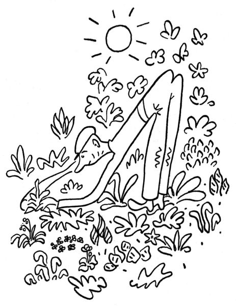
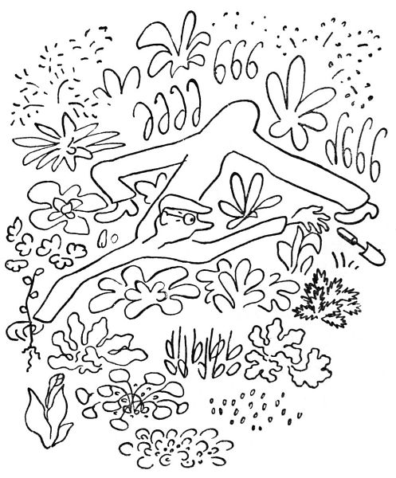
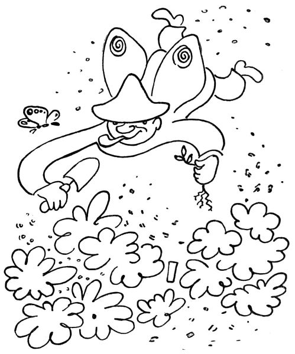
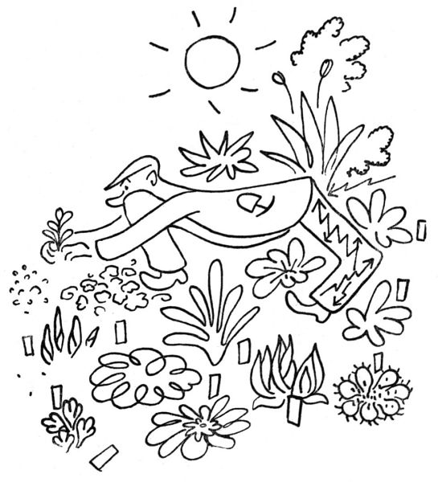

Duben, to je ten pravý a požehnaný měsíc zahradníkův. Ať si jdou do háje milenci se svým velebením máje; v máji stromy a květiny jenom kvetou, ale v dubnu _vyrážejí_; vězte, že toto klíčení a rašení, ty puky, pupence a klíčky jsou největším divem přírody, a víc už o nich neprozradím ani slovo; seďte sami na bobku a hrabejte sami prstem v kypré zemi, se zatajeným dechem, neboť řečený prst se dotýká křehkého a plného puku. To nelze líčit, tak jako nelze slovy líčit polibky a několik málo jiných věcí.

Ale když už jsme u toho křehkého puku, tedy nikdo neví, jak to přijde, ale stává se to nápadně často: když šlápnete do záhonku, abyste na něm sebrali uschlou větvičku nebo vypleli neřáda pampelišku, šlápnete obyčejně na podzemní puk lilie nebo upolínu; tak vám to křupne pod nohou, a vy ustrnete hrůzou a hanbou; v tu chvíli se považujete za netvora, pod jehož kopyty tráva neroste. Nebo s nekonečnou opatrností kypříte v záhonku půdu se zaručeným výsledkem, že rozseknete motyčkou rašící cibulku nebo hladce uříznete rýčem klíčky anemon; když zděšeni couvnete, rozdrtíte svou tlapou kvetoucí primulku nebo ulomíte mladý chvost delfinia. S čím úzkostlivější opatrností pracujete, tím víc natropíte škody; teprve léta praxe vás naučí mystické a surové jistotě pravého zahradníka, který šlápne, kam bůh dá, a přece nic nezašlápne; a když už, tedy si z toho aspoň nic nedělá. Tedy to jen tak mimochodem.

Duben je kromě rašení také měsíc vysazování. S nadšením, ano s divokým nadšením a nedočkavostí jste objednali u zahradníků sazenice, bez kterých byste nemohli být dále živi; slíbili jste všem přátelům zahrádkářům, že si k nim přijdete pro odnože; nikdy, pravím, nemáte dost na tom, co už máte. A tak se vám jednoho dne sejde doma nějakých sto sedmdesát sazenic, které chtějí do půdy; v tom okamžiku se rozhlédnete po své zahrádce a shledáte se zdrcující jistotou, že to nemáte kam dát.

  

Tedy zahradník v dubnu je člověk, který s vadnoucí sazeničkou v ruce dvacetkrát obíhá svou zahrádku, hledaje píď půdy, na které ještě nic neroste. „Ne, sem to nejde,“ bručí tiše, „tady mám ty zatracené chryzantémy; tady by mně to udusil flox, a tuhle je smolnička, čert ji vem. Hm, tady se mně rozlezl zvonek, a tuhle u toho řebříčku také není místo – kampak já to dám? Počkejme, semhle, – ne, tady už je oměj; nebo sem – ale tady je mochna. Tady by to šlo, ale je tu plno tradeskancie; a tuhle – copak to tu vyráží? To bych rád věděl. Aha, tady je drobátko místa; počkej, sazeničko, hned ti ustelu. Tak vidíš, a teď si spánembohem rosť.“

Ano, ale za dva dny zahradník shledá, že ji vsadil rovnou do nachově vyrážející pupalky.

  

Člověk zahradník vznikl zajisté kulturou, a nikoliv přírodním vývojem. Kdyby vznikl od přírody, vypadal by jinak; měl by nohy jako brouk, aby nemusel sedět na bobku, a měl by křídla, jednak pro tu krásu a za druhé proto, aby se mohl vznášet nad svými rabátky. Kdo to nezkusil, nemá ponětí, jak nohy člověku překážejí, nemá-li se nač postavit; jak jsou zbytečně dlouhé, je-li nutno je složit pod sebou a dloubat prstem v půdě; jak jsou nemožně krátké, má-li člověk dosáhnout na druhý kraj záhonu, aniž přitom šlápnul na polštář pyrethra nebo rašící orlíček. Nebo takhle být zavěšen na popruhu a houpat se nad svými kulturami, nebo aspoň mít čtyři ruce a na nich hlavu s čepicí a víc už nic; nebo mít údy vysunovací jako fotografický stativ. Ale jelikož je zahradník zevně uzpůsoben stejně nedokonale jako vy ostatní, nezbývá mu, než aby ukázal, co umí: aby balancoval na špičce jedné nohy, aby se vznášel jako carská baletka, aby se rozkročil na čtyři metry šířky, aby našlapoval lehce jako motýl či konipásek, aby se vešel na čtvereční coul půdy, aby se udržel v rovnováze proti všem zákonům o nakloněných tělesech, aby všude dosáhl a všemu se vyhnul a ještě se přitom pokoušel zachovávat jistou důstojnost, aby se mu lidé nesmáli.

Ovšem při zběžném pohledu zdálky nevidíte ze zahradníka nic než zadek; vše ostatní, jako hlava, ruce a nohy, je prostě pod ním.

Děkuju za optání, už toho bude hromada: narcisy, hyacinty i tacety; viola cornuta a pupkovec, lomikámen, draba i arabis i hutchinsia a petrklíče a jarní vřes, a co toho rozkvete zítra nebo pozítří, to budete koukat.

  

To se rozumí, koukat dovede každý. „Jej, to je pěkná lila kytička,“ řekne takový laik, načež mu zahradník trochu uraženě řekne: „To přece je Petrocallis pyrenaica.“ Neboť zahradník si potrpí na jména; květina beze jména je, abych to řekl platonsky, květina bez metafyzické ideje; zkrátka nemá tu pravou a plnocennou skutečnost. Květina bezejmenná je plevel; květina s latinským jménem je jaksi povýšena do stavu odbornosti. Vyroste-li vám na záhonku kopřiva, zapíchněte k ní jmenovku „Urtica dioica“, a počnete si jí vážit; ba i půdu jí zkypříte a přihnojíte ji čilským ledkem. Mluvíte-li se zahradníkem, zeptejte se ho vždycky: „Jak se jmenuje tahle růže?“

  

„To je Burmeester van Tholle,“ řekne vám zahradník potěšen, „a tahle je Madame Claire Mordier,“ a přitom si o vás s uznáním pomyslí, že jste slušný a vzdělaný člověk. A nehazardujte sami se jmény; neříkejte například „Tady vám kvete fajn Arabis“, když na vás může pak zahradník rozlíceně zahřímat: „Kdepak, to _přece_ je Schievereckia Bornmülleri!!“ Ono to je sice skoro jedno, ale jméno je jméno; a my zahradníci držíme na dobré jméno. Proto také nenávidíme děti a kosy, protože nám vytahují a popletou zapíchané jmenovky; pak se nám stane, že ukazujeme s podivem: „Koukejte, tady ten čilimník kvete docela jako protěž, – to je snad taková lokální variace; a je to určitě čilimník, protože je u něho má vlastní jmenovka.“

