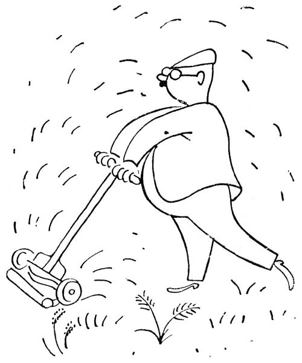
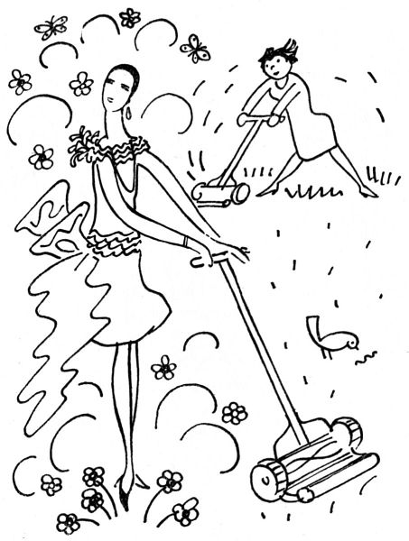
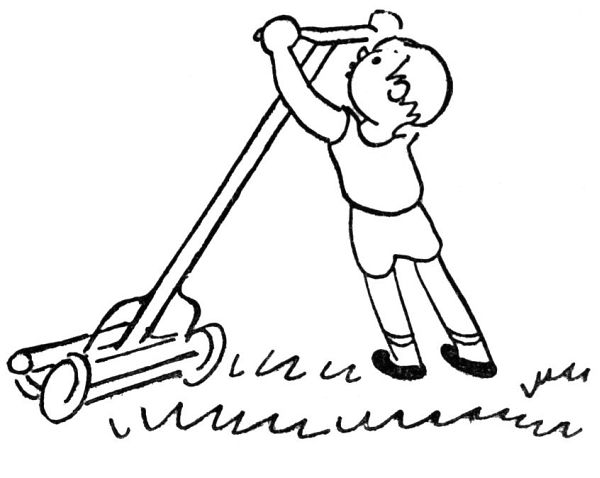
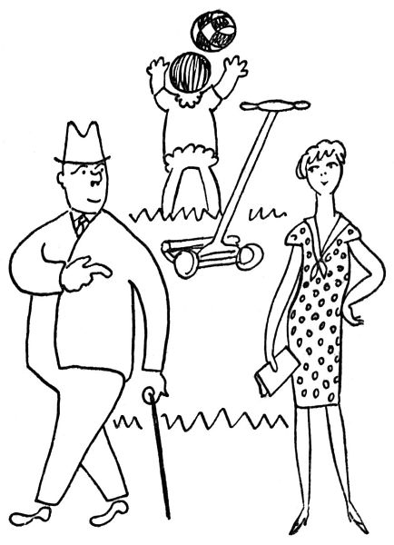

Červen je hlavní doba senoseče; ale pokud jde o nás, městské zahrádkáře, nepředstavujte si, prosím, že jednoho rosného jitra naklepeme kosu a pak s rozhalenou košilí, mohutnými rozmachy kosíme jiskřící trávu, až to sviští, zpívajíce přitom lidové písně. Věc vypadá poněkud jinak. Předně my zahradníci chceme mít anglický pažit, zelený jako kulečník a hustý jako koberec, pažit dokonalý, trávník bez poskvrny, drn jako samet, loučku jako stůl. Nuže, zjara shledáme, že tento anglický pažit pozůstává z jakýchsi lysin, pampelišek, jetele, hlíny, mechu a několika tvrdých a zažloutlých trsů trávy. Musí se to předně vyplet; tu tedy usedáme na bobek a vytahujeme z pažitu veškeru neřádnou plevel, nechávajíce za sebou půdu pustou, zdusanou a tak holou, jako by na ní tančili zedníci nebo stádo zeber. Pak se to zaleje a nechá se to na slunci rozpukat; načež se rozhodneme, že se to musí přece jen posekat.

Nezkušený zahradník se po tomto rozhodnutí sebere a jde do nejbližší periferie, až najde na ožrané a holé mezi babku s hubenou kozou okusující hloh nebo síť tenisového hřiště.

„Babičko,“ praví zahradník přívětivě, „nechtěla byste pěknou travičku pro vaši kozičku? – Mohla byste si jí u mne nažnout, kolik byste chtěla.“

„A co mně za to dají?“ řekne babička po nějakém rozvažování.

„Dvacet korun,“ praví zahradník a vrací se domů, aby čekal na babičku s kozou a srpem. Ale babička nepřichází.

Tu si zahradník koupí srp a brousek a prohlásí, že se nebude nikoho prosit a požne si svou trávu sám. Jenže buď je ten srp tak tupý, nebo městská tráva je tak tvrdá nebo co, zkrátka ten srp nebere; to se musí každé stéblo vzít za koneček, natáhnout a dole s velkou silou tím srpem přetnout, přičemž se obyčejně vyrvou i kořínky. Šicími nůžkami to jde podstatně rychleji. Když konečně zahradník ostříhal, oškubal a zpustošil svůj pažit, pokud to šlo, shrabal z toho přece jen jakousi kupičku sena; i sebere se a jde zase hledat babičku s kozou.

  

„Babičko,“ praví medově, „nechtěla byste si ode mne odnést nůši sena pro vaši kozičku? Je to pěkné, čisté seno –“

„A co mně za to dají?“ řekne babička po delší úvaze.

„Deset korun,“ prohlásí zahradník a běží domů čekat na babičku, která si má přijít pro seno; přece je škoda takové pěkné seno vyhodit, no ne?

Nakonec se toho sena ujme popelář, ale musí dostat korunu. „Tovedí, panešef,“ praví, „my to nemáme na vůz brát.“

  

Zkušenější zahradník si koupí prostě žací strojek; to je takové tento na kolečkách, rachotí to jako strojní puška, a když se s tím jede po trávě, tu stébélka zrovna lítají; říkám vám, to je jedna radost. Když přijde takový žací strojek do domu, perou se všichni členové rodiny od děda po vnuka o to, kdo bude žnout trávu; taková je vám to zábava, rachotit a kosit bujný pažit „Pusťte,“ prohlásí zahradník, „já vám ukážu, jak se to dělá.“ Načež se rozjede po trávníku s obřadností strojníka a oráče zároveň.

„Teď zase já,“ žadoní druhý člen rodiny.

„Ještě kousek,“ trvá na svém právu zahradník, a znovu se rozjede rachotě a kose trávu, až to lítá. To je první, slavnostní senoseč.

„Poslouchej,“ povídá po čase zahradník druhému členu rodiny, „nechtěl bys vzít strojek a posekat trávu? To je moc příjemná práce.“

  

„Já vím,“ praví ten druhý vlažně, „ale já dnes jaksi nemám kdy.“

Senoseč, jak známo, je doba bouřek. Několik dní se to podebírá na nebi i na zemi; slunce je palčivé a jaksi protivné, země se puká a psi páchnou; hospodář se dívá starostlivě k nebi a říká, že by mělo zapršet. Načež se objeví takzvané zlověstné mraky a strhne se divoký vítr ženoucí s sebou prach, klobouky a urvané listí; tu vyrazí zahradník na zahrádku s vlasy vlajícími, nikoliv aby vzdoroval živlům jako romantický básník, nýbrž aby přivazoval vše, co se klátí od větru, odnesl své nářadí a židličky a vůbec čelil živelným pohromám. Zatímco se marně pokouší přivázat stvoly delfinií, padají první velké a horké kápěje, udělá se chvíle k zalknutí, a prásk! za rachotu hromu vyšplíchne těžký liják. Zahradník se uteče na zápraží a s těžkým srdcem přihlíží, jak se zahrádka zmítá pod údery deště a vichřice; a když je to v nejhorším, vyřítí se jako muž, který zachraňuje tonoucí dítě, aby přivázal nalomenou lilii. Prokristapána, to je vody! Do toho zachrastí kroupy, poskakují po zemi a jsou smeteny potoky špinavých vod; a v srdci zahradníka zápasí úzkost o kytičky s takovým jakýmsi nadšením, jež v nás budí velké živelní úkazy. Potom to rachotí temněji, příval se změní ve studený déšť a řídne v přepršku. Zahradník vybíhá do ochlazené zahrádky, zoufale kouká na trávník zanesený pískem, na polámané kosatce a potrhané záhonky, a zatímco zakřičí první kos, volá přes plot na souseda: „Haló, mělo by nám ještě zapršet; na stromy je toho málo.“

Den nato píší noviny o katastrofální průtrži mračen, jež způsobila strašné pohromy zvláště na osení; ale nenapíší, že způsobila těžké škody zvláště na liliích nebo že zpustošila zejména Papaver orientale. My zahradníci jsme vždycky odstrčeni.

  

Kdyby to bylo něco platno, padl by zahradník denně na kolena a modlil by se asi takto: „Panebože, udělej to nějak tak, aby každý den pršelo asi tak od půlnoci do tří ráno, ale víš, tak pomalu a teple, aby to mohlo vsáknout; ale aby přitom nepršelo na smolničku, tařici, devaterník, levanduli a ty ostatní, které jsou Ti v Tvé nekonečné moudrosti známy jako byliny suchomilné, – kdybys chtěl, napíši Ti je na list papíru; a slunce aby svítilo po celý den, ale ne všude (například ne na tavolníky, aniž na hořec, bohyšku a rododendron) a ne tuze moc; aby bylo hodně rosy a málo větru, dost žížal, žádné mšice a slimáci, žádné padlí, a aby jednou za týden pršela zředěná močůvka a holubí trus, amen.“ Neboť vězte, že tak tomu bylo v zahradě ráje; jinak by to tam tak nerostlo, co vás nemá.

  

Ale když už jsem řekl slovo „mšice“, měl bych dodat, že zrovna v červnu se mají mšice hubit. Jsou na to všelijaké prášky, preparáty, tinktury, extrakty, odvary a smrady, arzen, tabák, šmír a jiné jedy, které zahradník jeden po druhém zkouší, jakmile shledá, že se mu na růžičkách povážlivě rozmnožují zelené, kypře nacucané mšice. Užíváte-li těchto prostředků s jistou opatrností a v náležité míře, shledáte, že vaše růže někdy přežijí toto hubení mšic bez úrazu, až na to, že se tím jaksi spálí list i poupata; co se týče mšic, prospívají během tohoto hubení neobyčejnou měrou, takže pokryjí větvičky růží jako husté krumplování. Potom je lze – s hlasitými projevy ošklivosti – větévku po větévce rozmačkávat. Tímto způsobem tedy se hubí mšice; ale zahradník čpí ještě dlouho potom tabákovým výtažkem a šmírem.
