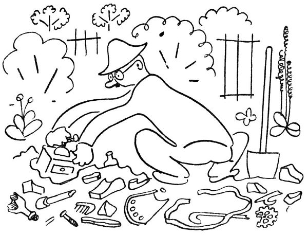
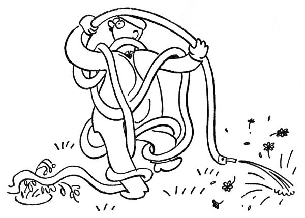
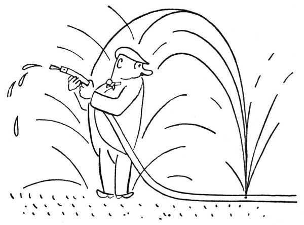
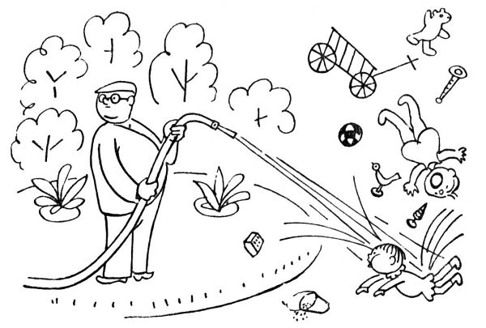
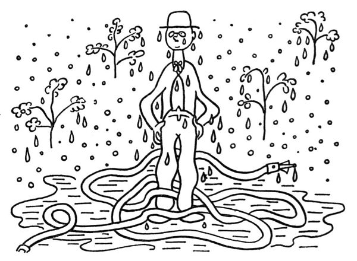

Podle kanonického práva zahradníků se v červenci _očkují růže_. Dělá se to obyčejně takto: připraví se šípek, pláně neboli podložka, na kterou se má očkovat; dále veliké množství lýka a posléze zahradnický nůž neboli žabka. Když je vše pohotově, vyzkouší zahradník ostří žabky na bříšku palce; je-li žabka dostatečně ostrá, zařízne do palce a nechá v něm rozchlípenou a krvácející tlamičku. Ta se potom ováže několika metry fáče, z čehož vznikne na prstě dosti velké a plné poupě. To se jmenuje očkování růží. Není-li po ruce šípek, lze si výše popsaný zářez do palce přivodit při jiné příležitosti, jako je dělání odprutců, odřezávání vlků nebo odkvetlých stvolů, stříhání keřů a podobně.

  

Dokončiv takto očkování růží, shledává zahradník, že by měl zase zkypřit v záhonku slehlou a speklou půdu. To se dělá asi šestkrát ročně, a pokaždé zahradník vyhází z půdy neuvěřitelné množství kamení a jiného neřádu. Patrně se to kamení rodí z nějakých semínek nebo vajíček, nebo vystupuje ustavičně z tajemného nitra země; snad země ty kameny nějak vypocuje. Zahradní čili kulturní půda, zvaná též humus nebo prsť, pozůstává vůbec z určitých ingrediencí, jež jsou: hlína, mrva, zetlelé listí, rašelina, kamení, střepy z půllitrových sklenic, rozbité mísy, hřebíky, dráty, kosti, husitské šípy, staniol z čokolády, cihly, staré mince, staré dýmky, tabulové sklo, zrcátka, staré jmenovky, plechové nádoby, provázky, knoflíky, podešve, psí trus, uhlí, ucha od hrnců, umyvadla, utěrky, lahvičky, pražce, bandasky, přezky, podkovy, plechovky od konzerv, izolátory, kusy novin a nesčetné jiné součásti, které překvapený zahradník vydobývá při každém kypření ze svých záhonků. Snad jednou vyhrabe pod svými tulipány americká kamna, Attilův hrob nebo Sibyliny knihy; v kulturní půdě je možno nalézt všechno.

  

Ale hlavní červencová starost je ovšem zalévání a kropení zahrady. Zalévá-li zahradník konvemi, počítá konve tak jako automobilista kilometry. „Uf,“ prohlašuje s pýchou rekordmana, „dnes jsem vytahal pětačtyřicet konví.“ Kdybyste věděli, jaká je to libost, když chladná voda crčí a šumí na zprahlou půdu; když to vpodvečer jiskří na květech a listech přetížených horlivou prškou; když pak celá zahrádka vydechne vlhce a úlevně, tak jako vydechne žíznivý poutník – „Ahahah,“ praví poutník stíraje si pěnu z vousů, „to byla hromská žízeň. Hospodo, ještě jednu!“ A zahradník běží ještě pro jednu konev na tu červencovou žízeň.

S hydrantem a hadicí lze kropit ovšem rychleji a jaksi ve velkém; za poměrně krátkou dobu postříkáme nejen záhony, ale i pažit, svačící rodinu sousedovu, chodce na ulici, vnitřek domu, všechny členy rodiny a nejvíce sebe samy. Takový střik z hydrantu má úžasnou účinnost, skoro jako strojní puška; můžete jím za okamžik vymlet do země jámu, pokosit pereny a servat stromům koruny. Znamenité osvěžení vám poskytne, stříkáte-li z hadice proti větru; to vám je přímo vodoléčba, jak vás to naskrz pokropí. Hadice má nadto zvláštní zálibu udělat si dírku někde uprostřed, kde se toho nejmíň nadáte; i stojíte pak jako bůh vod uprostřed tryskajících paprsků vody, s dlouhým vodním hadem stočeným u vašich nohou; je to překonávající pohled. Když pak jste mokří až na kůži, prohlásíte uspokojeně, že zahrádka má dost, a jdete se usušit. Zatím vaše zahrádka řekla „Uf“, vsrkla vaše vodomety ani nemrkajíc, a je zase suchá a žíznivá jako předtím.

Německá filozofie tvrdí, že hrubá skutečnost je prostě to, co je, kdežto vyšší a mravní řád je „das Sein-Sollende“ čili to, co má být. Tedy zahradník zejména v červenci velmi uznává tento vyšší řád, věda velmi dobře, co by mělo být. „Mělo by zapršet,“ vyjadřuje to zahradník svým výrazným způsobem.

To máte obyčejně tak: když takzvané životodárné sluneční paprsky to naberou nad padesát stupňů C; když tráva žloutne, listí na kytkách usychá a haluze stromů zplihle vadnou žízní a žárem, když země se puká, spéká se v kámen nebo rozpadá v palčivý prach, tu zpravidla:

  

1\. praskne zahradníkovi hadice, takže nemůže stříkat,

2\. stane se něco ve vodárně a neteče vůbec žádná voda, a jste, jak se říká, v troubě; dokonce v rozpálené a žhoucí troubě.

V takové době zahradník marně svlažuje půdu svým potem; představte si, jak by se musel potit, aby to stačilo řekněme na menší trávník. Rovněž nepomůže nadávat, klnout, rouhat se a vztekle odplivovat, i když s každým plivnutím běžíme do zahrady (každá kapka vláhy je dobrá!). Tu tedy se zahradník uchyluje k onomu vyššímu řádu a počne fatalisticky říkat: „Mělo by zapršet.“

„A kam jedete letos na letní byt?“

„Copak o to, ale zapršet by mělo.“

„A co říkáte Englišově demisi?“

„Já říkám, mělo by zapršet.“

Panečku, když si tak člověk představí takový krásný listopadový déšť; čtyři, pět, šest dní šumí chladné dešťové nitě; je šedivo a sychravo, teče do bot, čvachtá to pod nohami a zalízá do kostí –

Jak říkám, zapršet by mělo.

  

Růže a floxy, helenium a coreopsis, denivka, mečík, zvonky a oměj a oman a rojovník a kopretina – bůh zaplať, ještě dost toho kvete na ty špatné poměry. Pořád něco kvete a něco odkvétá; pořád abys odstřihoval odkvetlé stvoly bruče (ke květině, nikoli k sobě): „Taky už je s tebou amen.“

  

Hleďte, tyhle květiny, ono to je opravdu jako ženské: tak krásné a svěží, oči bys na tom nechal, a nikdy se nedohledíš té krásy, něco ti vždycky ujde, bože, když ona každá krása je taková neúkojná; ale jakmile to začne odkvétat, tu já nevím, tak nějak si přestanou dávat na sobě záležet (já mluvím o květinách), a kdyby chtěl být člověk hrubý, řekl by, že vypadají jako cumploch. Jaká škoda, má líbezná krásko (já mluvím o květinách), jaká škoda, že tak míjí čas; krása přechází a jen zahradník trvá.

Zahradníkův podzim se začíná už v březnu: první odkvetlou sněženkou.
