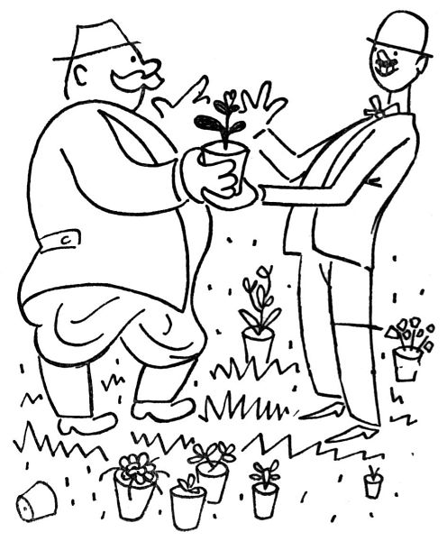
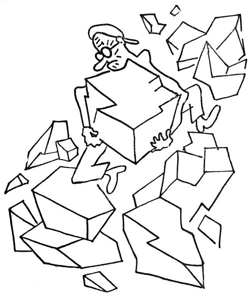

<section>

Svým způsobem – z hlediska zahradnického – je září vděčný a znamenitý měsíc; nejenom proto, že v něm kvete zlatobýl, aster podzimní a indické chrysanthemum, nejenom pro vás, těžké a ohromující jiřiny; vězte, nevěřící lidé, že září je vyvolený měsíc všeho, co kvete podruhé: měsíc druhého květu; měsíc zrající révy. To vše jsou tajemné přednosti měsíce září, plné hlubšího smyslu; nad to vše pak je to měsíc, kdy se opět otevírá země, takže už zase _můžeme sázet_! Teď má přijít do země, co se má do jara usadit; což nám zahradníkům dává příležitost, abychom opět pobíhali po pěstitelích, okukovali jejich kultury a vybírali si poklady pro nové jaro, a nadto mět příležitost, abych se zastavil v ročním koloběhu právě u těchto odborníků a složil jim svůj hold.

Zahradník veliký čili pěstitel je obyčejně muž nepijící, nekouřící a jedním slovem ctnostný; v dějinách není znám ani vynikajícími zločiny, ani válečnými nebo politickými skutky; jeho jméno bývá zvěčněno nějakou tou novou růží nebo jiřinou či jablíčkem; tato sláva – obyčejně anonymní nebo skrytá za jiným jménem – mu postačí. Zvláštní hříčkou přírody bývá to obyčejně člověk tělnatý a přímo mohutný, snad proto, aby tím byl vytvořen vhodný kontrast k útlé a filigránské spanilosti květin; nebo jej příroda uzpůsobila k obrazu Kybély[^15], aby znázornila jeho štědré otectví. Vskutku dloubá-li takový pěstitel prstem ve svých květináčích, je to skoro, jako by svým malým chovancům podával prs. Pohrdá zahradními architekty, kteřížto zase pěstitele považují za košťálníky. Vězte, že pěstitelství nepokládají za živnost, nýbrž za vědu a umění; je přímo zdrcující, řeknou-li o konkurentovi, že je dobrý obchodník. K zahradníku pěstiteli se nechodí jako k obchodníkovi s límci nebo se železným zbožím, abyste řekli, co chcete koupit, zaplatili a šli zas po svém. K zahradníkovi se chodí pohovořit si; ptát se, jak se jmenuje tohle, a sdělit, že se ta Hutchinsia, co jste loni u něho koupili, má k světu; naříkat, že letos utrpěly mertensie, a žadonit, aby ukázal, co má nového. Má se s ním prodebatovat, je-li lepší Rudolf Göthe nebo Emma Bedau (to jsou astřičky), jakož i hádat se, má-li Gentiana Clusii raději jíl nebo rašelinu.

Po těchto a mnohých jiných hovorech si vyberete jedno nové Alyssum (hergot, ale kam to dám?), jednu ostrožku, kterou vám sebralo padlí, a jeden hrnéček, o kterém se nemůžete s pěstitelem shodnout, co v něm vlastně je, a strávivše takto několik hodin v poučné a ušlechtilé zábavě, zaplatíte muži, jenž není obchodníkem, asi pět nebo šest kaček, a je to. A přece vás, trapiče, vidí takový pravý pěstitel raději než to panstvo, které přismrdí autem a uloží mu, aby jim vybral šedesát druhů „těch nejlepších květin, ale aby byly prima“.

  

Každý pěstitel se dušuje, že má na své zahradě docela špatnou půdu, že nemrví, nezalévá ani na zimu nepřikrývá; patrně tím chce říci, že jeho květiny tak dobře rostou z pouhé náklonnosti k němu. Něco na tom je; v zahradnictví musí mít člověk šťastnou ruku nebo takovou jakousi vyšší milost. Pravý zahradník může jen tak vpíchnout do země kus listu, a ona mu z toho vyroste kterákoliv kytka, zatímco my laikové se pipláme se semenáčky, vlažíme je, dýcháme na ně, krmíme je rohovou moučkou nebo dětskou moučkou; a nakonec nám to jaksi zaschne a zatáhne se. Myslím, že v tom jsou nějaká kouzla, podobně jako v myslivectví a v medicíně.

  

Vypěstit nový druh, to je tajný sen každého vášnivého zahradníka. Panečku, kdyby mně takhle vyrostla žlutá pomněnka, nebo pomněnkově modrý mák, nebo bílý hořec – cože, že ten modrý je krásnější? To je jedno; ale bílý hořec tu ještě nebyl. A pak, víte, i v těch květinách je člověk trochu šovinista; kdyby nějaká česká růže to vyhrála v celém světě nad takovou americkou lndependence Day nebo francouzskou Herriotkou, tu bychom se nadmuli pýchou a pukli bychom radostí.

  

Radím vám upřímně: máte-li na své zahrádce kousek svahu nebo terásku, zřiďte si tam skalku. Předně taková skalka je moc krásná, když zaroste polštářky lomikamenu, tařičky, tařice, huseníku a jiných přepěkných horských kytiček; za druhé pak samo budování skalky je dílo znamenité a poutavé. Muž, který si staví skalku, se cítí jako Kyklop, když tak říkajíc s elementární silou vrší balvan na balvan, buduje vrchy a údolí, přenáší hory a vytyčuje skalní útesy. Když pak, stržen v háku, dokončil své gigantské dílo, shledává, že to vypadá poněkud jinak než jako romantické pohoří, které si byl představoval; že jeho výtvor připomíná hromádku šutru a kamení. Nic si z toho nedělejte; za rok se vám toto kamení změní v nejkrásnější záhon, jiskřící drobnými květy a zarostlý nejpěknějšími polštáři; a vaše radost bude veliká. Říkám vám, postavte si skalku.

  

Už si to nelze zapírat: je podzim. Poznáte to podle toho, že kvetou podzimní astry a podzimní chryzantémy, – tyhle podzimní květy kvetou s obzvláštní silou a hojností; nedělají mnoho cavyků, květ jako květ, ale zato jich je! Pravím vám, že tento rozkvět zralého věku je mocnější a vášnivější než ty neklidné a prchavé hejble mladého jara. Je v tom rozum a důslednost dospělého člověka: když už kvést, tedy důkladně; a mít hodně medu, aby přišly včeličky. Co to je, takový padající list, nad tím bohatým rozkvětem podzimním? Copak nevidíte, že není únavy?

</section>

[^1]: Trvalky. _Pozn. red._

[^2]: Odnož. _Pozn. red._

[^3]: Pověrečné zaříkávání. _Pozn. red._

[^4]: Hněv opěvuj, bohyně. _Pozn. red._

[^5]: Kyselá slatinná zemina, rašelina. _Pozn. red._

[^6]: Rašeliník. _Pozn. red._

[^7]: Krondaro/kromdar – lejno. _Pozn. red._

[^8]: Shawl (angl.) – pléd, přehoz. _Pozn. red._

[^9]: Pochodové tempo. _Pozn. red._

[^10]: Odnož, řízek. _Pozn. red._

[^11]: Pontus euxinus – lat. název pro severní pobřeží Černého moře. _Pozn. red_.

[^12]: Zvyková pravidla. _Pozn. red._

[^13]: Kněžská pokrývka hlavy. _Pozn. red._

[^14]: Sečná i bodná orientální zbraň se zahnutou čepelí. _Pozn. red._

[^15]: Kybelé – v řec. mytologii maloasijská bohyně uctívaná jako „velká matka bohů a všeho živého“. _Pozn. red._

[^16]: Hromadný nástup. _Pozn. red._

[^17]: Lámavá, křehká. _Pozn. red._

[^18]: Arne Novák (1880–1939), literární kritik a historik. _Pozn. red._

[^19]: Zdeněk Nejedlý (1878–1962), historik, muzikolog, umělecký kritik, politik, později ministr školství (ve funkci v letech 1945–1946, 1948–1953). _Pozn. red._

[^20]: Rojnice, z. něm. Schwarmlinie, tj. rozmístění bojové jednotky v řadě. _Pozn. red._
