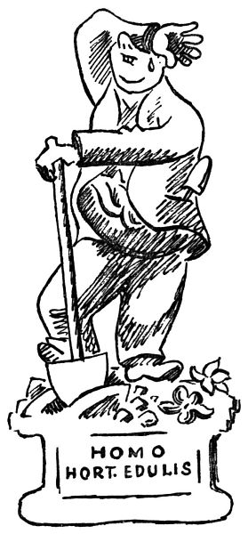
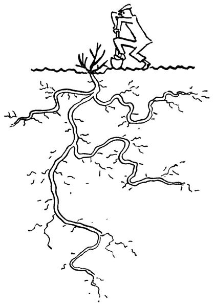
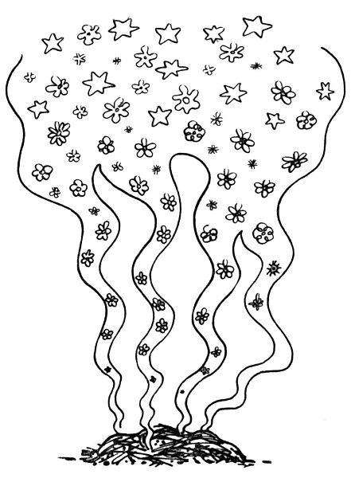
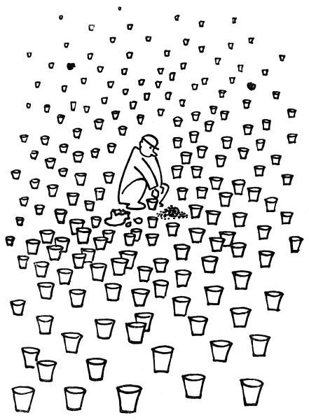

Já vím, že je mnoho krásných povolání, například psát do novin, hlasovat v parlamentě, sedět ve správní radě nebo podpisovat úřední lejstra; ale jakkoliv to všechno je pěkné a záslužné, člověk při tom nedělá tu figuru a nemá tak monumentální, plastický a přímo sochařský postoj jako _muž s rýčem_. Pane, když tak stojíte na svém záhonku, jednou nohou opřen o rýč, stíraje si pot a pravě „Uf“, tu vypadáte rovnou jako alegorická socha; stačilo by vás pozorně vyrýt, vyzvednout i s kořínky a postavit na sokl s nápisem „_Triumf práce_“ nebo „_Pán země_“ nebo tak nějak. To říkám proto, že teď je k tomu zrovna čas, totiž k tomu rytí.

  

Ano, v listopadu se má obracet a kypřit půda; nabírat ji plným rýčem, to je tak chutný a labužnický pocit, jako byste nabírali plnou sběračkou, plnou lžicí jídlo. Dobrá půda, tak jako dobré jídlo, nesmí být ani příliš mastná, ani těžká, ani studená, ani tuze mokrá, ani tuze suchá, ani mazlavá, ani tvrdá, ani kruchá[\[17\]](./resources/undefined), ani syrová; má být jako chleba, jako perník, jako buchta, jako kynuté těsto; má se rozsejpat, ale nemá se drobit; má pod rýčem rupnout, ale nemá mlaskat; nemá dělat lavice, ani hlavy, ani plástve, ani knedlíky, nýbrž když ji plným rýčem obrátíte, má libostí vzdychnout a rozpadnout se v hroudy a krupičkovou prsť. Toto pak jest půda chutná a jedlá, vzdělaná a šlechetná, půda hluboká a vlahá, propustná, dýchající a měkká, zkrátka dobrá půda, tak jako jsou dobří lidé; a jak známo, v tomto slzavém údolí už není nic lepšího.

Věz, člověče zahradní, že v tyto podzimní dny se ještě může _přesazovat_. To se nejdřív dokola okope a obryje keř nebo stromek co nejhlouběji; potom se podebere rýčem odspodu, načež obyčejně rýč praskne vedví. Jsou lidé, hlavně kritikové a veřejní řečníci, kteří rádi mluví o kořenech; například hlásají, že se máme vracet ke kořenům, nebo že nějaké zlo se má vyvrátit z kořene, nebo že máme proniknout až ke kořenům některé věci. Nuže, rád bych je viděl, kdyby měli vykopat (s příslušnými kořeny) řekněme tříletou kdouli. Rád byl bych svědkem toho, kdyby pan Arne Novák[\[18\]](./resources/undefined) se ponořil až ke kořenům třeba jen tak malého keříčku, jako je Ruscus. Přál bych si pozorovat, jak pan Zdeněk Nejedlý[\[19\]](./resources/undefined) vyvrací z kořene dejme tomu starší topol. Myslím, že by se po delší námaze narovnávali v kříži a pronesli jen jedno slovo. Vezmu na to jed, že by to slovo bylo „Hergot!“ Já jsem to zkusil s cydoniemi; i potvrzuji, že práce s kořeny je těžká a že je lepší nechat kořeny tam, kde jsou: ony už vědí, proč chtějí být tak hluboko; řekl bych, že nestojí o naši pozornost. Ono je lépe nechat ty kořeny být a raději zlepšit půdu.

  

Ano, zlepšit půdu. Taková fůra hnoje je nejkrásnější, když vám ji přivezou za mrazivého dne, aby dýmala jako hranice obětní. Když pak její dým dostoupí až k nebesům, začichá tam nahoře ten, jenž všemu rozumí, a řekne: Aha, to je nějaká pěkná mrvička! – Zde bychom ovšem měli příležitost mluvit o tajemném koloběhu života; takový kůň se nažere ovsa, a pak to pošle zas dál karafiátům nebo růžím, jež za to v příštím roce budou chválit Boha vůní tak líbeznou, že se to popsat nedá. Nuže, tuto líbeznou vůni postihuje zahradník už v té dýmající a slamnaté hromadě mrvy; i čichá mlsně a pozorně rozestýlá tento boží dar po celé zahrádce, tak jako by svému dítěti natíral krajíček chleba marmeládou. Tumáš, budulínku, ať ti to chutná! Vám, paní Herriotová, dám celou hromádku, za to, že jste tak pěkně a bronzově kvetla; abys neřekla, řimbabo, dostaneš tady tu kobližku; a tobě nastelu té hnědé slámy, horlivý floxe.

Proč krčíte nosem, lidé? Copak vám nevoním?

Ještě maličko, a prokážeme své zahrádce poslední službu; ještě necháme přejít nějaký ten podzimní mrazík, a pak jí usteleme v zeleném chvojí; ohneme růže a přihrneme jim ke krčkům půdy, naklademe voňavých větví smrkových, a dobrou noc. Obyčejně člověk tím chvojím zakryje i ledacos jiného, řekněme kapesní nůž nebo fajfku; zjara, až sundáme chvojí, se se vším zas sejdeme.

  

Ale ještě tam nejsme, ještě jsme nepřestali kvést; ještě dušičkový aster mrká lila očima, vykvétá petrklíč a fialka na znamení, že i ten listopad je jaro, chrysanthemum indické (zvané tak proto, že není z Indie, nýbrž z Číny) si nedá žádnými sebehoršími povětrnostními ani politickými poměry bránit v tom, aby vydalo celé své křehké a nesmírné bohatství květů, květů ryšavých a bělostných, zlatých a brunátných; ještě posledními květy pokvétá růže. Královno, po šest měsíců jsi rozkvétala; jsi to zajisté povinna svému postavení.

  

A pak, ještě nám rozkvétá listí: podzimní listí žluté a nachové, zrzavé, oranžové, paprikově rudé, krvavě hnědé; a rudé, oranžové, černé, modře ojíněné bobule; a žluté, zarudlé, světlé dřevo holých větviček; ještě nejsme hotovi. A i když zapadnou sněhem, ještě tu budou temně zelené cesmíny s řeřavě červenými plody a černé borovice a cypříšky a tisy; nikdy tomu není konec.

Říkám vám, smrt není; není ani spánek. Rosteme jenom z doby do doby. Musíme mít s životem trpělivost, neboť je věčný.

Ale i vy, kdo nevládnete nějakým tím záhonkem vlastní půdy ve vesmíru, můžete se v této podzimní době klanět přírodě, a sice tím, že si zasázíte do květináčů cibulky hyacintů a tulipánů, aby vám během zimy buď zmrzly, anebo rozkvetly. To se dělá tak: koupíte si příslušné cibulky a u nejbližšího zahradníka pytel pěkné kompostní půdy; načež vyhledáte ve sklepě a na půdě všechny staré květináče a do každého dáte po cibulce. Ke konci shledáte, že máte ještě několik cibulek, ale žádné květináče. I nakoupíte květináčů, načež zjistíte, že už sice nemáte žádných cibulek, ale zato vám přebývají květináče a půda. Tu nakoupíte pár dalších cibulek, ale protože vám zase nestačila půda, koupíte si nový pytlík kompostky. Pak vám zase přebývá půda, kterou ovšem nechcete vyhodit, a raději si zase přikoupíte nějaké květináče a cibulky. Tím způsobem pokračujete dále, až vám to domácí lidé zakáží. Potom tím naplníte okna, stoly, skříně, spižírnu, sklep a podkroví, načež s důvěrou hledíte vstříc nastávající zimě.
