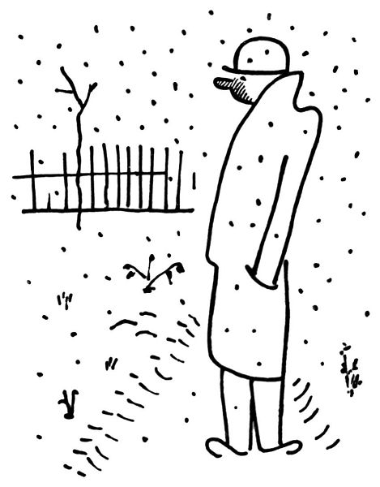
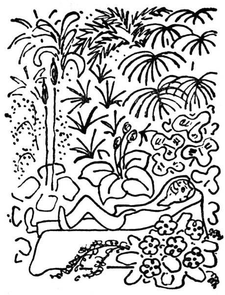
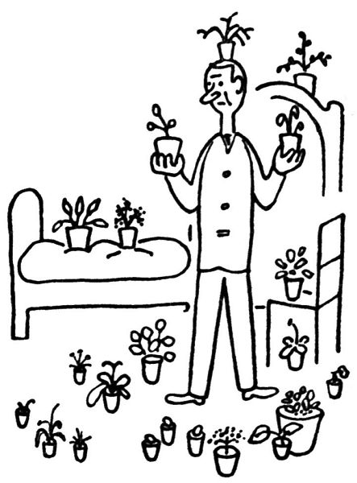

Baže, teď už je všechno hotovo. Až do této doby ryl, kopal a kypřil, převracel, mrvil a vápnil, prosypával půdu rašelinou, popelem a sazemi, ořezával, sil, sázel, přesazoval, dělil, kladl do země cibulky a vyndával na zimu hlízy, kropil a proléval, sekl trávu, plel, kryl kytky chvojím nebo jim přihrnul ke krčku půdy; toto všecko dělal od února do prosince, a teprve teď, když mu zahrádka zapadla sněhem, si vzpomíná, že na něco zapomněl: podívat se na ni. Neboť vězte, že na to neměl pokdy. Když se v létě běžel podívat na kvetoucí encián, musel se cestou zastavit, aby vytahal z trávy plevel. Když se chtěl pokochat krásou rozkvetlých delfinií, shledal, že jim musí dát hůlky. Když mu rozkvetly astry, běžel pro konev, aby je zalil. Když mu kvetl flox, vytahoval pejřavku; když mu kvetly růže, koukal, kde jim má ořezat vlky nebo potírat padlí; když mu vykvetly chryzantémy, vrhl se na ně s motykou, aby jim zkypřil slehlou půdu. Co chcete, pořád bylo co dělat; copak můžeš strčit ruce do kapes a jen tak okukovat, jak to vypadá?

Teď už je, chválabohu, všechno hotovo; ono by se dalo ještě ledacos tento; tamhle vzadu je půda jako cejn, a tu centaureu jsem chtěl vlastně přesadit, ale pokoj s vámi; už napadl sníh. Což, zahradníku, aby ses šel poprvé _podívat_ na svou zahrádku?

Tak tohle černé, co čouhá ze sněhu, je brunátná viscaria; tohle suché stéblo je modrý orlíček; tenhle chuchvalec spáleného listí je astilbe. A hleďme, tamhleto košťátko je aster ericoides, a tady, co není nic, je oranžový upolín, a tady ta hromádka sněhu je dianthus, to se rozumí, dianthus. A tamten stonek, to je asi červený řebříček.

Brr, to zebe! Člověk se ani v zimě nemůže pokochat svou zahrádkou.

  

Nu dobře, tedy mi zatopte; nechme už zahrádku spát v lehké peřině sněhu. Je dobře myslet i na jiné věci; máme plný stůl nepřečtených knížek, i dejme se do nich; máme tolik jiných plánů a starostí, i začněmež s nimi. Jestlipak jenom jsme všechno dobře zakryli chvojím? Dali jsme dost příkrovu tritomě, nezapomněli jsme pokrýt plumbago? A kalmie by se měla zastínit nějakou větévkou; jestlipak nám nezmrzne azalka? Což když nám nevzejdou hlízky asijského pryskyřníku? V tom případě vysadíme na jejich místo… počkejme… Počkejme, na to se podíváme do některého ceníku.

  

Tedy zahrádka v prosinci je obsažena hlavně ve velikém množství zahradnických katalogů. Zahradník sám přezimuje pod sklem ve vytopené místnosti, zahrnut až po krček nikoliv mrvou ani chvojím, nýbrž zahradnickými ceníky a prospekty, knihami a brožurami, ve kterých se dočítá:

1\. že nejcennější, nejvděčnější a naprosto nepostradatelné kytky jsou ty, které ve své zahrádce dosud nemá;

2\. že všechno, co tam má, je „poněkud choulostivé“ a „rádo vymrzá“; nebo že vysadil na jednom záhonku vedle sebe kytku, „která vyžaduje vlhko“, a kytku, „kterou je nutno chrániti před vlhkem“; že to, co se zvláštní pozorností vysadil do nejplnějšího slunce, si žádá „plný stín“, a vice versa;

3\. že existuje tři sta sedmdesát nebo ještě více druhů květin, které „zasluhují více pozornosti“ a „neměly by scházet v žádné zahradě“; nebo které jsou aspoň „zcela nová a překvapující odrůda, daleko překonávající dosavadní výsledky“.

Z toho všeho se obyčejně zahradník v prosinci velmi zasmuší; jednak se počíná děsit, že mu na jaře nevzejde ani jedna z jeho kytek následkem mrazu nebo zapaření, vlhka, sucha, slunce a nedostatku slunce; pročež hloubá, čím tyto strašné mezery nahradí.

  

Za druhé shledává, že i když mu toho zajde co nejméně, nebude mít ve své zahrádce skoro žádný z těch „nejcennějších, bohatě kvetoucích, zcela nových, nepřekonatelných“ druhů, o kterých se právě dočetl v šedesáti katalozích; i toto jest zajisté nesnesitelná mezera, kterou je nutno nějak vyplnit. Tu tedy se přezimující zahradník naprosto přestává zajímat o to, co na své zahrádce má, jsa pln toho, co na ní nemá, čehož je ovšem daleko více; vrhá se na katalogy a zatrhává si v nich, co si musí objednat, co mu proboha už nesmí na zahrádce chybět. V prvním rozběhu si zatrhne čtyři sta devadesát peren, které si stůj co stůj objedná; když si je spočítá, je poněkud zchlazen a krvácejícím srdcem počíná vyškrtávat ty, kterých se pro tentokrát zřekne. Tuto bolestnou eliminaci musí provádět ještě pětkrát, až mu zbývá už jen nějakých sto dvacet „nejkrásnějších, nejvděčnějších, nepostrádatelných“ peren, které – okřídlen pronikavou radostí – ihned objedná. „Pošlete mi je začátkem března.“ – Bože, kýž by už byl březen, myslí si přitom se zimničnou netrpělivostí.

  

Nuže, bůh ho oslepil; v březnu shledá, že s největší námahou najde na své zahrádce tak stěží dvě nebo tři místa, kam se dá ještě něco zasadit, a to ještě jen u plotu za keři japonských kdoulí.

Když vykonal tuto hlavní a – jak patrno – poněkud ukvapenou zimní práci, počíná se zahradník nezkrotně nudit; protože „v březnu se to začne“, počítá dny do března, a jelikož jich je příliš mnoho, odečte od nich patnáct dní, protože „někdy se to začne už v únoru“. Co platno, musí se čekat. Tu tedy se člověk zahradník vrhne na něco jiného, řekněme na sofa, pohovku nebo na chaise longue, a pokouší se o zimní spánek přírody.

Za půl hodiny vyletí z této rovnovážné polohy, inspirován novou myšlenkou. Květináče! Vždyť je možno pěstovat kytky v květináčích! Rázem se mu zjeví houští palem a latanií, dracén a tradeskancií, asparágů, klívií, aspidister, citlivek a begonií v celé své tropické kráse; a mezi nimi, víme, pokvete nějaká ta urychlená primule a hyacint a brambořík; z předsíně uděláme rovníkovou džungli, po schodech budou splývat visuté úponky a do oken dáme kytky, které pokvetou jako blázni. Tu tedy člověk zahradník vrhne rychlý pohled kolem sebe; nevidí už pokoj, který obývá, nýbrž rajský prales, který tu vytvoří, a běží k zahradníkovi za roh, aby si přinesl plnou náruč vegetačních pokladů.

Když tedy si nanese domů, co pobere, shledá:

že když to dá všechno dohromady, nevypadá to nikterak jako rovníkový prales, nýbrž spíše jako menší hrnčířský krám;

že nemůže nic dát do oken, protože – jak mu fanaticky tvrdí domácí ženské – okna jsou k tomu, aby se jimi větralo;

že nemůže nic dát na schody, protože prý se tím nadělá svinstva a nacáká vody;

že nemůže změnit svou předsíň v tropický prales, protože přes jeho úpěnlivé prosby a klnutí si ženské nedají vzít, aby tam neotvíraly oken do mrazivého vzduchu.

Tu tedy odnese člověk zahradník své poklady do sklepa, kde, jak se utěšuje, aspoň nemrzne; a zjara, rýpaje se ve vlahé půdě venku, na ně zapomene jako na smrt. Kterážto zkušenost mu nikterak nebude vadit, aby příštího prosince znovu nezkusil novými květináči předělat svůj příbytek v zimní zahradu. V tom vidíte věčný život přírody.

