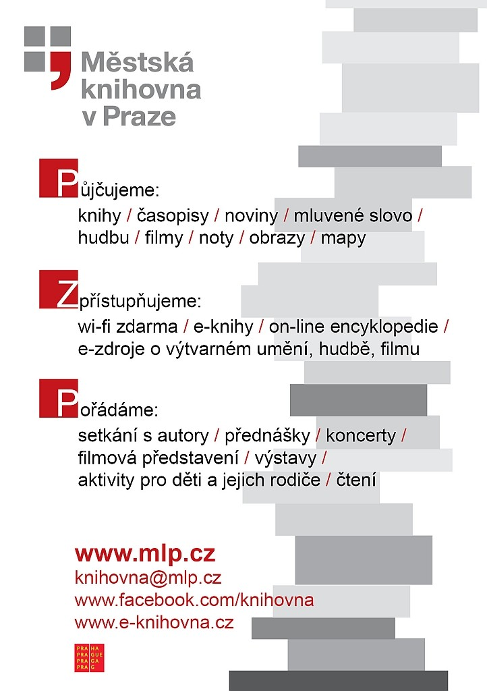

<section>

</section>

[^1]: Trvalky. _Pozn. red._

[^2]: Odnož. _Pozn. red._

[^3]: Pověrečné zaříkávání. _Pozn. red._

[^4]: Hněv opěvuj, bohyně. _Pozn. red._

[^5]: Kyselá slatinná zemina, rašelina. _Pozn. red._

[^6]: Rašeliník. _Pozn. red._

[^7]: Krondaro/kromdar – lejno. _Pozn. red._

[^8]: Shawl (angl.) – pléd, přehoz. _Pozn. red._

[^9]: Pochodové tempo. _Pozn. red._

[^10]: Odnož, řízek. _Pozn. red._

[^11]: Pontus euxinus – lat. název pro severní pobřeží Černého moře. _Pozn. red_.

[^12]: Zvyková pravidla. _Pozn. red._

[^13]: Kněžská pokrývka hlavy. _Pozn. red._

[^14]: Sečná i bodná orientální zbraň se zahnutou čepelí. _Pozn. red._

[^15]: Kybelé – v řec. mytologii maloasijská bohyně uctívaná jako „velká matka bohů a všeho živého“. _Pozn. red._

[^16]: Hromadný nástup. _Pozn. red._

[^17]: Lámavá, křehká. _Pozn. red._

[^18]: Arne Novák (1880–1939), literární kritik a historik. _Pozn. red._

[^19]: Zdeněk Nejedlý (1878–1962), historik, muzikolog, umělecký kritik, politik, později ministr školství (ve funkci v letech 1945–1946, 1948–1953). _Pozn. red._

[^20]: Rojnice, z. něm. Schwarmlinie, tj. rozmístění bojové jednotky v řadě. _Pozn. red._
